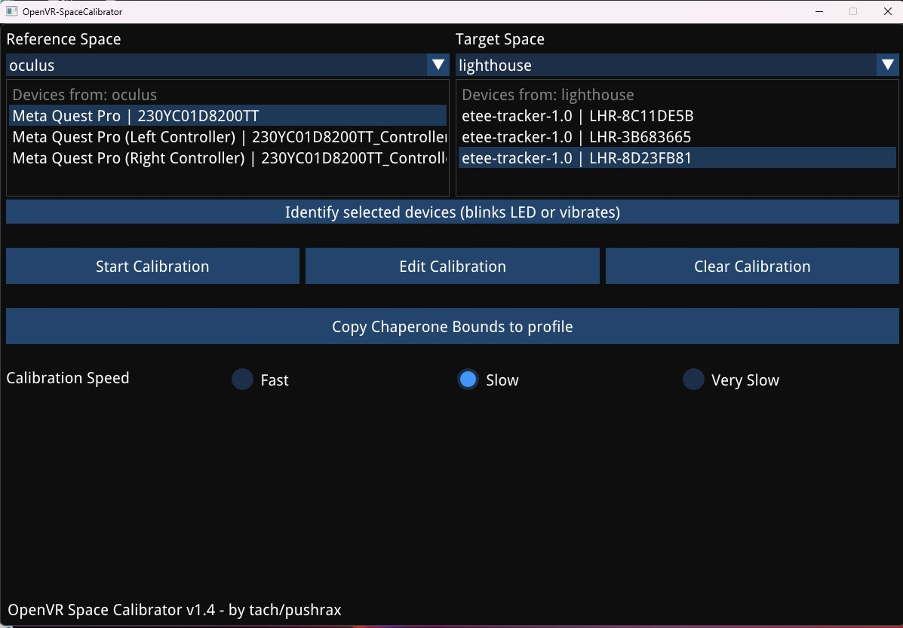
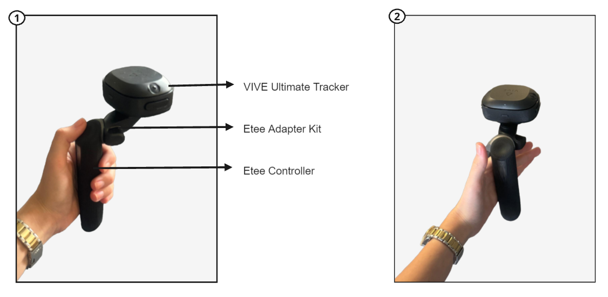
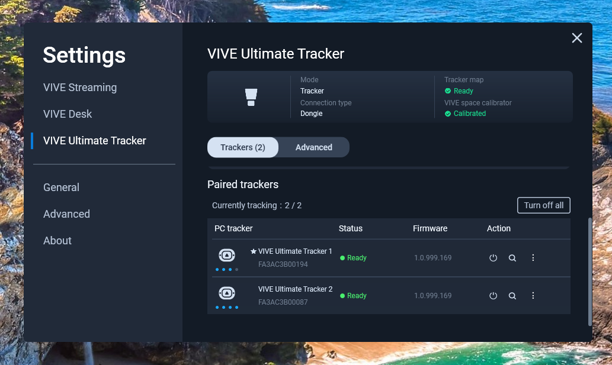
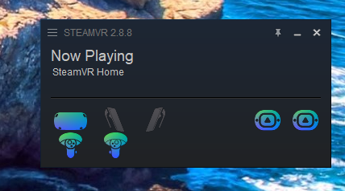
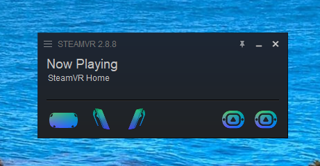

# etee-controllers-with-meta-quest-pro

_HOW TO USE Etee CONTROLLER WITH META QUEST PRO HEADSET?_

Virtual reality (VR) technology has evolved, with different manufacturers adopting distinct tracking systems for their headsets. For example, Oculus headsets utilize an inside-out tracking system that is compatible with Oculus controllers. This system relies on built-in cameras in the headset to track the user's movements.   
  
In contrast, other VR systems like those from Tg0 and HTC use an external base station approach for tracking. These systems require additional hardware called base stations, which are placed around the room to track the user's movements and the positions of the controllers. While this setup offers greater precision, it is more complex compared to inside-out tracking systems.
Due to these fundamental differences, combining hardware from different systems (e.g., using etee controllers with a Meta Quest Pro headset) is not natively supported due to compatibility issues. However, specialized software solutions can make this possible.  
  
One such solution is [OpenVR Space Calibrator](https://github.com/pushrax/OpenVR-SpaceCalibrator), which acts as a bridge, enabling the integration of different VR hardware systems. This software allows users to calibrate and align tracking data from disparate systems, making it possible to use, for example, the etee controller (by Tg0) with an Oculus headset.  
  
The following tutorial requires 2 HTC Vive headsets. This requirement is because the Vive headsets have built-in RF (radio frequency) receivers that can connect to and track the movements of the controllers. In this tutorial, these 2 HTC Vive headsets are used as a substitute for purchasing dongles for tracking purposes. Using dongles eliminates the need for additional headsets. One HTC Vive headset can track two devices, so if you are not going to use Vive headsets, you need to purchase dongles additionally.  

**Prerequests**:   
  
**Hardware:**  
•	Meta Quest Pro Headset  
•	2 etee Controllers  
•	3 etee Trackers  
•	1 etee Dongle  
•	2 HTC Vive Headsets  
•	2 HTC Vive Link Box  
  
**Software:**  
•	Oculus App  
•	Steam and Steam VR  
•	 [OpenVR Space Calibrator](https://github.com/pushrax/OpenVR-SpaceCalibrator) 

💥 _STEP BY STEP PROCESS_  💥  
1.	Make sure all required software is installed.    
2.	Connect each of the two Vive Headsets to your computer BUT **unplugged the HDMI and USB cables** from both Vive Headsets which will allow you to use the tracking capabilities of the Vive Headsets without their visual displays.   
3.	Turn off your HTC Vive Link box to avoid conflicts with your Meta Quest Pro Headset.  
4.	Turn on your Meta Quest Pro headset.  
5.	Launch the Quest application on your PC.
6.	In your headset settings, select Quest Link to establish a connection between your Meta Quest Pro Headset and your PC.
7.	After establishing a connection between your headset and PC, launch Quest Link on your Meta Quest Pro headset.
8.	Once you have successfully launched Quest Link on your Meta Quest Pro headset, you'll be in a white virtual environment. There will be a virtual screen displaying various options directly in front of you. Look for a menu located under this screen. Navigate through this menu and select the “Desktop” option to access your PC's desktop through the Quest Link interface.
9.	Launch Steam VR from your PC`s desktop within Quest Link. 
10.	Turn on your HTC Vive Link box and plugged the HDMI cable.   
11.	At this stage, you should see that your Meta Quest Pro headset is now successfully connected within the Steam VR.
12.	Insert your Etee dongle to your PC.
13.	Pair your two Etee controllers with your two Etee trackers to Steam VR.    
14.	Attach the third etee tracker on the Meta Quest Pro headset. This tracker will be used for hand tracking.   
15.	Launch the OpenVR Space Calibrator app on your PC. You need to calibrate your Meta Quest Pro Headset and the tracker attached to it. 
16.	Under 'Reference Space,' select 'Oculus,' then choose 'Meta Quest Pro' as your headset.
17.	On the right-hand side, under 'Target Space,' select 'Lighthouse' and choose the name of the tracker attached to your headset.

    
        

_Space Calibrator Interface_

18.	Set the calibration speed to **slow**.                                  
29.	Hold your Etee controllers in your hands during the calibration.                    
20.	Perform the calibration by moving your head in a large figure-eight pattern. Continue until two progress bars are filled, indicating the calibration is complete.                   

**_UPDATE_** 

To use the etee VR controller with the Oculus Meta Quest Pro HMD, VIVE Ultimate Trackers are used with Etee Adapter kit. This setup allows to connect the HMD with the etee VR controllers without the need for base stations. See Figure 10 for the setup of the etee controllers.

[Etee Adapter Kit](https://eteexr.com/products/eteeadapter?srsltid=AfmBOoqisgJvjPTgSSRQPBgQWi9woZkj4V32-GLdwdxQ0e6CMyqWBsCx)  used to attach Vive Ultimate tracker to the controller.

    

_UPDATED TUTORIAL:_ 

**Hardware:** 
•	Meta Quest Pro Headset and controllers
•	2 Etee controllers  
•	1 Etee dongle  
•	Etee Adapter kit
•	2 HTC Vive Ultimate Trackers with their dongle
  
**Software:**
•	Meta Quest Link
•	Vive Hub
•	Steam and Steam VR  

1. _Ensure Vive Ultimate Trackers are Tracking_

Open Vive Hub and turn on the Vive Ultimate Trackers. You need to stand around 1.5 meters away from the computer and position the trackers at your chest height for proper tracking. 

   

2. Open Steam VR on your PC. 

3. Put on your Meta Quest Pro headset. Make sure the HMD is connected to Meta Quest Link on your PC. 

Then, launch Air Link from the HMD to establish a connection with your PC. 

4. Press the menu button (three horizontal lines) on the left Quest controller. Select the Space Calibrator icon.

4. _Calibrate your Quest controllers with Vive Ultimate trackers._ 

Follow the calibration process to calibrate your Quest controllers with the Vive Ultimate Trackers.

The system may only allow fOr one Quest Controllers which is alright. 

5. After the calibration, you should see the Vive ultimate trackers in VR. 

   

6. Exit Steam VR. Place the Quest controllers outside the VR boundary. Turn on your Etee controllers (They should remain off until this step). Do not forget to connect your Etee Dongle to your PC. Restart Steam VR. 

7. In the Steam VR, you should now see only HMD, 2 Etee controllers and 2 Vive Ultimate Trackers. 

 

Setup is complete! 
